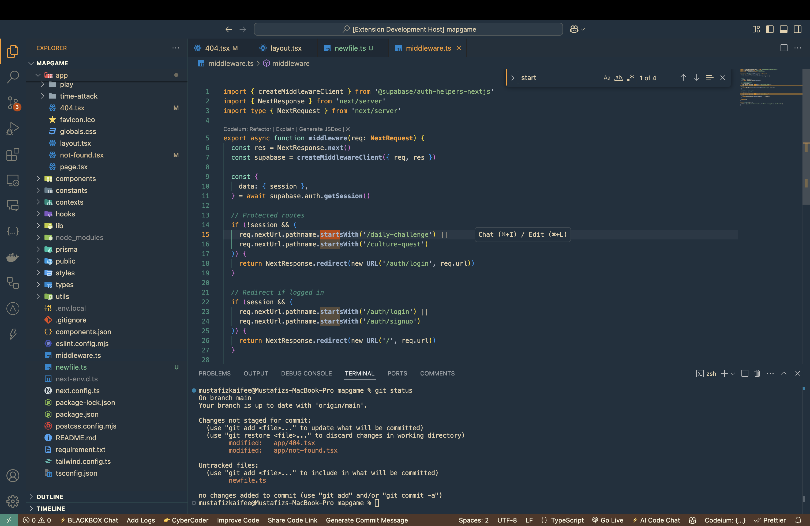

# Dark Marine Theme
A sleek and modern dark theme for VS Code, created by [Mustafiz Kaifee](https://mustafizkaifee.in) for a comfortable coding experience and carefully chosen colors for syntax highlighting.

## Installation 🛠️

From the VS Code Marketplace

1. Open VS Code
2.	Go to Extensions (Ctrl+Shift+X / Cmd+Shift+X)
3.	Search for "Dark Marine"
4.	Click Install and Set Color Theme

## Manual Installation
1.	Download the .vsix file from GitHub Releases (if available)
2.	Open VS Code and press Ctrl+Shift+P (Cmd+Shift+P on Mac)
3.	Run “Extensions: Install from VSIX…”
4.	Select the downloaded file and install

## Activating the Theme 🎨

1.	Open Command Palette (Ctrl+Shift+P / Cmd+Shift+P)
2.	Type "Preferences: Color Theme"
3.	Select Dark Marine

## Screenshots 🖼️

## Contributing 🤝

Feel free to submit issues or feature requests in the [GitHub repository](https://github.com/Mustafiz04/vs-colour-theme/tree/main/dark-marine).
